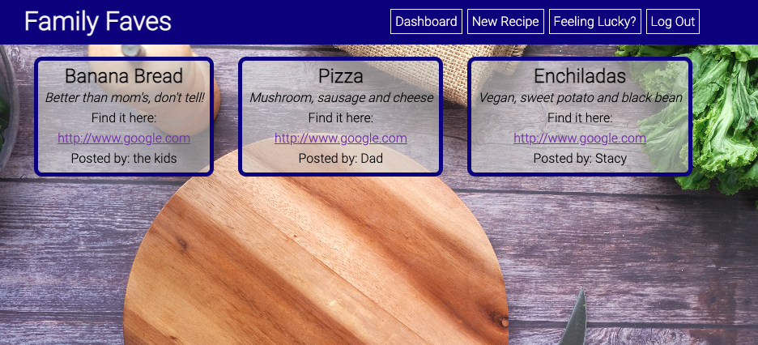
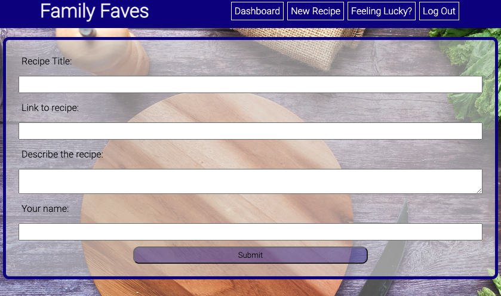
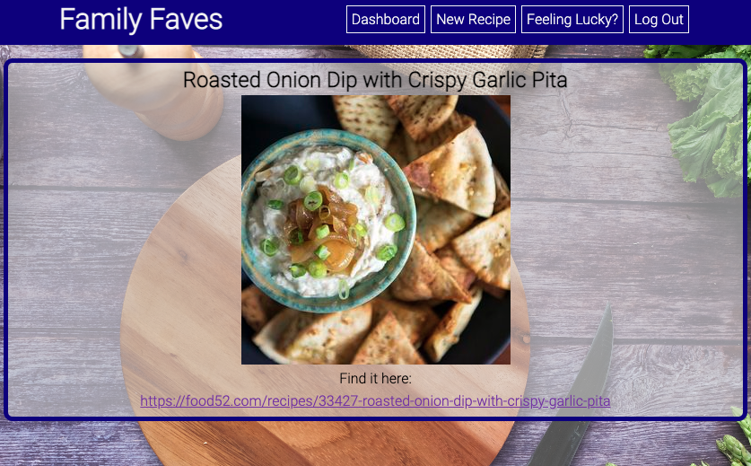

  # Family Faves

  ## Description 
  An app to share your favorite recipes with your family

  On the project learning and challenges:
  * Connecting a database - Sqlite3 versus MySQL - ended up with Sqlite3
  * Learning a python environment coming from a node background
  * flask-session
  
  ## Table of Contents
  * [Installation](#installation)
  * [Usage](#usage)
  * [Built With](#buitl-with)
  * [Questions](#questions)
  
  
  
  

  ## Installation
  ~~~
  pip install -r requirements.txt
  ~~~
  ## Usage

  Clone the repo, run init_db.py to create and seed the database. 
  Create account at https://www.edamam.com/ to access the Recipe API (feeling lucky page).
  Add api_key and app_id to environment variables file.
  Create a secret key and add to environment variables file.

  ## Built With
  
  * Flask
  * Sqlite3
  * Edamam API
  
  ## Questions

  Contact me at madalyne@madalynecross.com with any questions. View more of my work here: [violanerd](https://github.com/violanerd).